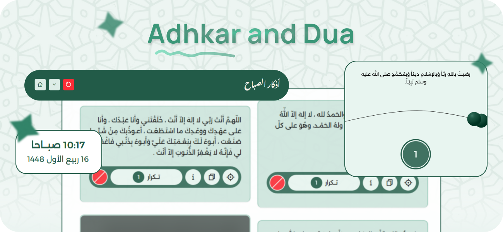

<!-- Main Image — Hero Section -->

  

<!-- Used Technologies -->

  
  
  
  
  

<!-- Project Name -->
<h3 align="center">Adhkar-and-Dua App</h3>
 

<!-- Project Type -->

   
   
   

<!-- Project Overview & Desc.. -->
## 📝&nbsp; About **...**
⇨ ...

◈ `Feature` → ...

◈ `Feature` → ...

◈ `Feature` → ...

 

<!-- Real Showcase-->
## 🎬&nbsp; Demo & Showcase

 

<!-- What Learn from that Project -->
## 🧠&nbsp; What I Learned 

① **`Master React + SessionStorage`** → Let me provide the `Temporary Data Saving` Feature in a Seamless and Advanced Way.

② **`Master React + FetchAPI`** → The core of the app is the Showen Data, that comes originaly from an open-source API.

③ **`Get Correct Hijri Time`** → Let me provide the app with an `Islamic Time` Clock support since it's an arabic & islamic app.

④ **`Master Preloader Animation`** → Enhance the `UX` with a Smooth Animation that runs ones on page's first loads.
